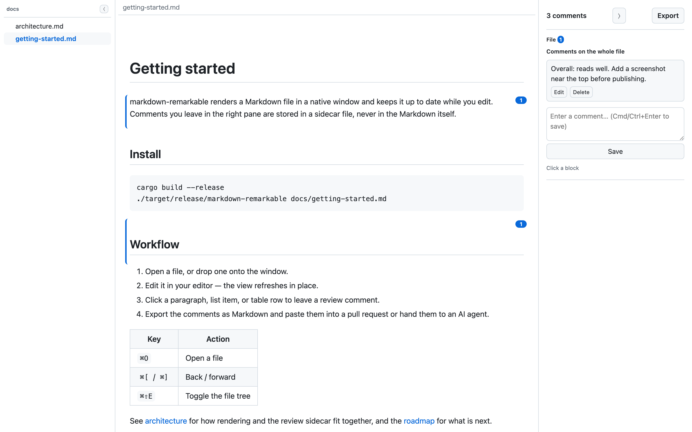
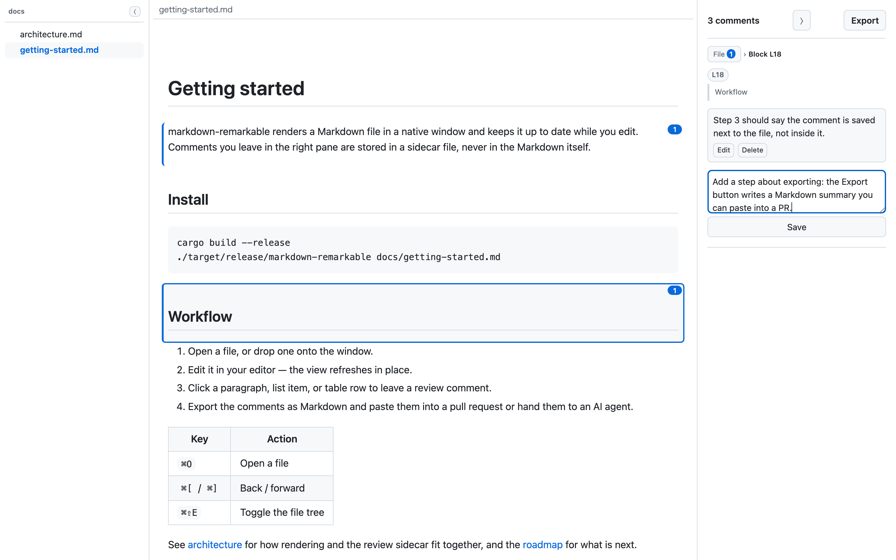

# markdown-remarkable

A native Markdown viewer with live reload and inline review comments. Save
the file in your editor; the window updates in place. Select a paragraph,
list item, or table row and leave a comment — it's stored in a sidecar file
next to the document, never in the Markdown itself.





## Why

- **Review comments live beside the document, not inside it.** Comments are
  saved in `<file>.review.json` next to the Markdown file; the document
  itself is never edited.
- **Export a review as Markdown.** One click turns every commented block
  into a short, quotable summary — handy for pasting into an AI agent or a
  pull request description.
- **No network access by default.** There's no HTTP client dependency at
  all; the only mode that opens a socket is `--browser`, and it only binds
  to `127.0.0.1`. A strict Content-Security-Policy blocks remote images
  unless you pass `--allow-remote-images`, and `http(s)`/`mailto:` links
  are handed off to the OS's default browser/mail client rather than
  fetched by the app itself. See [Security](#security).
- **Single static binary.** CSS and JS are embedded at compile time — no
  install step, no bundled browser engine, just the OS's own WebView.

## Quick start

```sh
cargo build --release
./target/release/markdown-remarkable README.md
```

This opens a native window showing the rendered file, and updates it in
place every time you save. Prebuilt zips for macOS (Apple Silicon) and
Windows (x86_64) are published on the [Releases](../../releases) page for
each tagged version. Linux and Intel Macs build from source.

Prefer a browser tab over a native window?

```sh
./target/release/markdown-remarkable README.md --browser
```

## Features

### Rendering

GitHub-style Markdown: tables, strikethrough, task lists, and footnotes are
all supported. There's no syntax highlighting and no in-app editing — this
is a viewer, not an editor. Light and dark themes follow the OS/browser's
`prefers-color-scheme`. Leading YAML frontmatter (a block starting with
`---` and closed by the next `---` or `...`) is stripped and not rendered
(see Limitations for an edge case). HTML comments (`<!-- ... -->`) are
discarded entirely rather than shown as text. Raw HTML in the source is
shown as literal, inert text rather than being executed, and
`javascript:`/`data:`-style link and image targets are neutralized — this
narrows the most common script-injection vectors in a Markdown file, not a
general claim that viewing any untrusted file is safe.

### Live updates

The window (or browser tab) swaps in freshly rendered content in place,
preserving scroll position, instead of doing a full reload. It's
directory-watch based, so it works with editors that save "atomically" via
a temp file plus rename. Deleting the watched file shows a "failed to
read" message instead of the old content, and the view recovers on its own
once the file exists again.

### File tree and multi-window navigation

A left-hand file tree lists the `.md`/`.markdown` files under the
directory of the file the window first opened (the window's root
directory; it does not move when you switch files), so you can switch
between files in the same window.
Clicking a relative link to another Markdown file (e.g.
`[see also](../notes/other.md)`) does the same thing — unless that file is
already open in a different window, in which case that window is brought
to the front instead, so two windows never end up racing to write the same
review sidecar. A doc header shows **◀**/**▶** buttons for per-window
back/forward history through everywhere you've navigated (also `⌘[`/`⌘]`).

Each `FILE` on the command line gets its own independent native window —
own watcher, title, zoom level, and history — cascaded slightly down and to
the right of the last one so new windows don't stack exactly on top of each
other. Closing a window (⌘W) only closes that one; the app quits once every
window is closed, or all at once on ⌘Q. `--browser` mode has no per-window
history, and a relative link is just left to the browser's own default
click behavior — but the file tree still renders in `--browser`; switching
files from it (and the back/forward buttons) is disabled, since `PUT
/open` and `PUT /nav` both answer `501` there.

### Local images

A local, relative-path image (``) displays in the live
view as long as it resolves to a file inside the open Markdown file's own
parent directory, with an allowed extension
(`png`/`jpg`/`jpeg`/`gif`/`webp`/`bmp`/`svg`/`avif`/`ico`) and a size under
20 MiB. External (`http(s)`) images are blocked unless you pass
`--allow-remote-images` — see [Security](#security).

### Review comments and export

Every top-level block in the document — a paragraph, heading, list, code
block, table, blockquote, etc. — gets a right-hand review pane. Click a
block to select it, then write a comment and save it (a Save button, or
Cmd/Ctrl+Enter). List items and table rows (including the header row) can
be commented on individually, not just the list/table as a whole, and the
document as a whole can carry file-wide comments via the pane's permanent
"File" breadcrumb segment.

Comments are matched to blocks by a hash of the block's trimmed source, so
they survive reloads and reordering elsewhere in the document. If a
commented block's source changes or is deleted, its comments become
"unanchored" and move to a collapsible section at the bottom of the pane,
where you can re-attach or delete them.

See [Review comments and export](#review-comments-and-export-1) below for
the file format and how to hand a review to an AI agent.

## Keyboard shortcuts

macOS uses Cmd; Windows/Linux use Ctrl for the same shortcuts unless noted.

| Shortcut | Action |
|---|---|
| ⌘O | Open a file (macOS menu only) |
| ⌘W | Close the current window (macOS menu only) |
| ⌘Q | Quit — closes every window at once (macOS menu only) |
| ⌘R | Reload |
| ⌘+ / ⌘- / ⌘0 | Zoom in / out / reset |
| ⌘[ / ⌘] | Navigate back / forward through file history |
| ⌘⇧E | Toggle the file tree pane |
| ⌘\ or ⌘J | Toggle the review pane |
| Alt+↑ / Alt+↓ | Move to the previous/next sibling comment anchor |
| Alt+← / Alt+→ | Move to the enclosing / first nested comment anchor |
| Cmd/Ctrl+Enter | Save the comment being edited |
| Esc | Deselect the current block, or select the file-wide comment |

`⌘[`/`⌘]` and the doc header's ◀/▶ buttons only exist in the native window;
`--browser` mode has no per-window history. On keyboard layouts where
`[`/`]` require AltGr (many European layouts), `⌘[`/`⌘]` may not be
reachable — the doc header's own buttons still work.

`⌘O`/`⌘W`/`⌘Q` come from the macOS app menu (see Platform notes) and only
work there; Windows/Linux have no menu bar, so open a file by dragging it
onto a window or passing it as a CLI argument, and close a window with its
own close button. On macOS, ⌘R and the zoom shortcuts (⌘+/⌘-/⌘0) are menu
accelerators from the app menu's View submenu; everywhere else, and for
every other shortcut in the table above, the same keys are handled in JS
instead. The effect is identical either way.

## CLI reference

| Flag | Default | Description |
|---|---|---|
| `--browser` | off | Show the file in your default browser instead of opening a native window. Requires exactly one `FILE`. |
| `--port <PORT>` | `0` | Port to listen on. `0` lets the OS pick a free port. Only applies to `--browser`. |
| `--no-open` | off | Don't open the browser automatically. Only applies to `--browser`. |
| `--export <OUT.html>` | — | Render to a standalone HTML file and exit, instead of showing it live. Requires exactly one `FILE`, and is mutually exclusive with `--browser`/`--port`/`--no-open`. Refuses to write over the input file itself. |
| `--allow-remote-images` | off | Load `http(s)` images referenced by the document. Off by default, since a remote image is an outbound request to a host the document's author chose. Applies to the native window, `--browser`, and `--export` alike. |

With no `FILE`, a native "open file" dialog appears; cancelling it shows an
empty "drop a Markdown file here" window. You can drag & drop one or more
`.md`/`.markdown` files onto a window at any time.

Set the environment variable `MDVIEW_DEBUG=1` to log every request the
native window's WebView makes to stderr — handy for checking that live
updates are actually flowing.

```sh
# Native window, drag & drop a file in (or use the open dialog)
markdown-remarkable

# Browser mode: pick a fixed port and skip opening a browser
markdown-remarkable notes.md --browser --port 8080 --no-open

# Render to a static HTML file (no live reload, no window, no server)
markdown-remarkable notes.md --export notes.html
```

## Review comments and export

Comments live in `<file>.review.json` next to the Markdown file (e.g.
`notes.md` -> `notes.md.review.json`). The **Export** button in the pane
header writes `<stem>.review.md` (e.g. `notes.md` -> `notes.review.md`) — a
Markdown summary of every commented block, in document order: each one as
a one-line quote giving its source line range and excerpt (`> L12-L18: ##
Design notes`) followed by its comments. The block's full source isn't
quoted — for handing a review to an AI agent, the line range plus a short
excerpt is enough to locate the block. A **Copy to clipboard** button then
appears so you can put the same text on your clipboard in a separate
click, for pasting into an AI agent or a PR description.

Exporting a comment on a list item or table row adds a `(in list L10-L20)`
/ `(in table L40-L48)` suffix naming the enclosing list/table's line
range. File-wide comments get a leading `> (file): <name>` section ahead
of any block sections. The document itself is never edited by any of
this. `--export`'s standalone HTML output has no review pane at all (there
is no server for it to talk to).

## Security

Everything runs entirely locally: there is no HTTP client dependency, and
the only mode that opens a socket (`--browser`) binds to `127.0.0.1` only.
External images are blocked by default; raw HTML in a document is rendered
inert. See [docs/SECURITY.md](docs/SECURITY.md) for the full audit —
exactly which files are read/written, the CSP, and the known exceptions
(remote images, link clicks, `--browser` mode).

## Platform notes

### macOS app bundle

```sh
scripts/bundle-macos.sh            # builds target/bundle/markdown-remarkable.app
scripts/bundle-macos.sh --install  # ...and copies it to /Applications
```

This produces a double-clickable app that also shows up in Finder's "Open
With" menu for `.md`/`.markdown` files. It's built for the machine's native
architecture (on Apple Silicon with a Rosetta-installed rustup, run
`rustup target add aarch64-apple-darwin` first) and ad-hoc signed by
default, which is enough to run on your own machine. macOS 15+ won't let an
ad-hoc signed app become the *default* handler for `.md`, though — sign
with a real identity to enable that:

```sh
security find-identity -v -p codesigning   # list available identities
MDVIEW_SIGN_IDENTITY="Apple Development: you@example.com (TEAMID)" \
  scripts/bundle-macos.sh --install
```

The icon comes from `packaging/macos/mdview.icns` (regenerate with
`scripts/make-icon.py`, which needs Pillow).

The native windows share a single minimal menu bar on macOS only (Open,
Quit, Copy, Select All, Close Window, plus a View submenu with Zoom In,
Zoom Out, Actual Size, and Reload) — this is where `⌘O`/`⌘W`/`⌘Q` and the
zoom/`⌘R` accelerators come from. On Linux and Windows there's no menu
bar: open a file by dragging it onto a window or passing it as a CLI
argument, close a window with its own close button, and use the
JS-handled shortcuts from the table above (`⌘R`/zoom/history/pane-toggle/
etc., with Ctrl in place of ⌘) for everything else.

### Linux dependencies

The native window uses WebKitGTK; `--browser` mode has no such
requirement.

```sh
# Debian / Ubuntu
sudo apt-get install -y libwebkit2gtk-4.1-dev libgtk-3-dev libxdo-dev

# Fedora
sudo dnf install -y gtk3-devel webkit2gtk4.1-devel

# Arch
sudo pacman -S webkit2gtk-4.1 gtk3
```

If WebKitGTK isn't available at runtime, the native window fails to start
with an error message pointing at `--browser` as a fallback. Saving review
comments from the native window needs WebKit2GTK 2.40 or newer; on an
older system, use `--browser` instead.

The "open file" dialog goes through `xdg-desktop-portal` over D-Bus;
without a portal/D-Bus session it silently yields nothing.

### Windows

No extra system dependencies are needed to build. At runtime, the native
window needs the Microsoft Edge WebView2 Runtime, which ships preinstalled
on Windows 11; on older systems, install the [Evergreen
Bootstrapper](https://developer.microsoft.com/microsoft-edge/webview2/).

```sh
cargo build --release
```

produces `target\release\markdown-remarkable.exe`, built with the GUI
subsystem so launching it from Explorer or a `.md` file association opens
no console window. Launched from a terminal instead, it attaches to that
terminal's console so `--browser`/`--export` still print their usual
output there. There's no menu bar (macOS only), so `⌘O`/`⌘W`/`⌘Q` have no
Windows equivalent: open a file by dragging it onto a window or passing it
as a CLI argument, and close a window with its own close button. The
JS-handled shortcuts from the table above (`Ctrl+R`/zoom/history/
pane-toggle/etc.) work the same as on macOS. `--export`'s same-path and
symlink self-overwrite checks apply on Windows too; the additional
hard-link check is Unix-only.

### Code signing

Neither build is signed with a certificate that machines other than yours
already trust, so both trigger an "unknown publisher"-style warning when
someone else runs them.

**Windows**: SmartScreen's warning is driven by *reputation*, not merely by
the presence of a signature — a freshly-signed exe still warns until it's
been run by enough people. Making it go away reliably needs either an OV
code-signing certificate (roughly $100/year) or [Azure Trusted
Signing](https://learn.microsoft.com/azure/trusted-signing/overview)
(roughly $10/month). For personal use, click "More info" -> "Run anyway" on
the SmartScreen prompt, or run `Unblock-File markdown-remarkable.exe`; see
`scripts/sign-windows-selfsign.ps1` for self-signing across your own
machines, and the `WINDOWS_CERT_PFX_BASE64`/`WINDOWS_CERT_PASSWORD` repo
secrets for signing in CI.

**macOS**: distributing to other people's machines cleanly needs a
Developer ID certificate plus notarization (the [Apple Developer
Program](https://developer.apple.com/programs/), $99/year). For a build on
your own machine, the default ad-hoc signature is enough. On someone else's
machine, right-click -> Open on first launch, or run
`xattr -dr com.apple.quarantine markdown-remarkable.app` after unzipping;
the `MACOS_SIGN_IDENTITY` repo secret threads a real codesign identity into
CI builds.

### Development

See [CONTRIBUTING.md](CONTRIBUTING.md) for the dev environment setup and
the exact commands CI runs.

## Limitations

- Each native window still shows one file at a time — dropping, picking,
  or opening a file while a window that already has one is frontmost opens
  a *new* window for it rather than replacing that window's content, unless
  that file is already open in some other window (in which case that
  window is brought to the front instead). There's no tabs, no window list
  menu, and no combined export across windows.
- `http(s)`/`mailto:` links in a native window never navigate the window
  itself — they open in your default browser instead. In `--browser` mode,
  an unmodified `http(s)` link opens in a new browser tab instead of
  navigating the tab already showing the document.
- A relative *link* is only handled as in-app navigation in the native
  window; in `--browser` mode it's a same-tab 404 (recoverable with the
  browser's own back button). Even in the native window, a `#fragment` or
  `?query` on the link is discarded (headings don't get an `id`, so
  there's nothing to scroll to — only the file switch happens), a
  Cmd/Ctrl/Shift/Alt-click is inert — nothing happens at all, not even the
  browser's/OS's own default modifier-click behavior — and a relative link
  to anything other than `.md`/`.markdown`, or a root-relative link
  (`/other.md`), is likewise inert rather than navigating. Relative links
  are confined to the window's root directory; a link that climbs above
  it does nothing.
- Frontmatter detection only checks whether the very first line is `---`
  — a document that happens to open with a horizontal rule is treated the
  same way and loses everything up to the next `---`/`...` line. Review
  comments previously anchored inside that stripped span become
  unanchored rather than disappearing.
- `--export`'s standalone HTML file has no server behind it once written,
  so a local/relative-path image won't display there.
- The `.app` bundle is macOS-only and ad-hoc signed by default (no
  Developer ID, no notarization) — meant for your own machine. There's no
  installer for Linux or Windows.
- Review comments are per-block/per-item/per-row, not per-cell,
  per-line, or per-selection, and there's no reply thread or
  resolved/unresolved status — just a flat list of comments per anchor.
  Two anchors with identical (trimmed) source hash the same and so share
  comments. The `.review.json` sidecar isn't watched for external changes
  — edit it by hand at your own risk.
- The pane header's comment count includes unanchored comments, but the
  Export summary's headline count only covers anchored ones; unanchored
  comments are called out separately as `(+U unanchored)`.
- Saving a review from a version of markdown-remarkable that predates
  file-wide comments discards any existing `file_comments` — `PUT
  /review` replaces the whole sidecar in one request.
- Footnote reference numbers reset per block (and, within a list/table
  block, per list item/table row), instead of counting up sequentially
  across the whole document.

## Contributing

See [CONTRIBUTING.md](CONTRIBUTING.md) for how to set up a dev
environment and submit changes, and
[docs/qa/baseline-checklist.md](docs/qa/baseline-checklist.md) for the
manual QA checklist covering behavior that isn't automated in `cargo
test`.

## Changelog

See [CHANGELOG.md](CHANGELOG.md).

## License

MIT. See [`LICENSE`](LICENSE).
